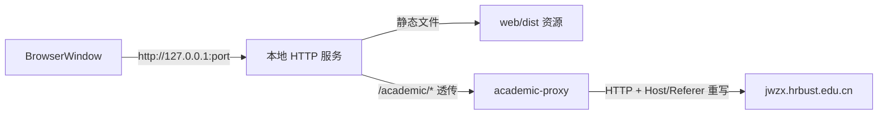

## Product Overview

将现有 web/ 前端封装为 Windows 桌面应用（Electron）。主进程内置一个仅监听 127.0.0.1 的本地 HTTP 服务：静态托管 `web/dist` 构建产物，并将 `/academic/*` 反向代理到教务系统（行为与 `web/vite.config.mjs` 的开发代理完全一致）。前端代码零改动，登录会话（Cookie）在应用内正常工作。

## Core Features

- 双击即用的桌面窗口（免浏览器、免 node 环境）
- 内置 `/academic` 本地反向代理：Host/Referer 注入、Cookie 域改写、302 Location 重写
- 单实例运行：重复启动聚焦已有窗口
- 会话数据持久化于用户目录（重启应用后教务会话仍有效，直至教务侧过期）
- 打包产出两种 Windows 产物：NSIS 安装包 + 免安装 zip，供仓库 Release 分发
- 开发模式：可直连 `npm run dev` 的 Vite 开发服务器热调试

## Tech Stack

- Electron（主进程 ESM：`main.mjs`）
- `http-proxy`（与 Vite 代理同底层库，`cookieDomainRewrite`/`autoRewrite` 原生支持，保证行为平移的确定性）
- `electron-builder`（Windows 目标：nsis + zip）
- 静态文件服务手写实现（零依赖，参照 `tools/probe/server.mjs` 的本地服务模式）

## Implementation Approach

- 新建 `desktop/` 独立 Node 工程，与 `web/`、`tools/` 平级，沿用仓库"子目录各自维护 package.json、根目录无清单"的惯例
- 本地服务绑定 `127.0.0.1` + 端口 0 随机分配，主进程取实际端口后 `loadURL('http://127.0.0.1:<port>')`；`http://127.0.0.1` 是 Chromium 的 secure context，无明文/混合内容限制
- 反代规则 1:1 平移自 `web/vite.config.mjs:6-29`：`changeOrigin`、`autoRewrite`、`cookieDomainRewrite: ''`、Host/Referer 头、`proxyRes` 中重写 302 Location 为 `/academic/` 相对路径
- 代理出错时销毁 socket（不返回 502 页面），使前端 `fetch` reject，走 `web/src/services/academic/client.js:138` 既有的"网络连接失败……请确认是否处于校园网或VPN环境"提示路径
- 前端 `client.js` 已在前端完成 GBK 解码与会话判定，代理只做字节透传，不碰编码
- 打包：`extraResources` 将 `../web/dist` 放入资源目录；主进程按 `app.isPackaged` 区分读取 `process.resourcesPath/webapp` 与开发期的 `../../web/dist`
- 性能与可靠性：代理为字节流透传，O(请求大小)；单用户本地服务，无并发瓶颈；教务会话 Cookie 落在 Electron userData 目录，跨重启保留



## Directory Structure Summary

```
BetterHRBUST/
├── desktop/
│   ├── package.json           # [NEW] Electron 工程清单：main 入口、dev/pack/dist 脚本、依赖 electron/http-proxy/electron-builder
│   ├── electron-builder.yml   # [NEW] Windows 打包配置：appId、nsis+zip 目标、extraResources 引用 ../web/dist
│   ├── README.md              # [NEW] 构建、运行、分发说明（含 SmartScreen 绕过提示）
│   ├── build/icon.ico         # [NEW] 应用图标，由 web/public/HRBUST.png 转换生成（失败则用 Electron 默认图标）
│   └── src/
│       ├── main.mjs           # [NEW] 主进程：单实例锁、窗口创建（1280x800、隐藏菜单栏）、服务器生命周期、ELECTRON_START_URL 开发直连
│       ├── local-server.mjs   # [NEW] 本地静态服务：mime 映射、路径穿越防护、未知路径回退 index.html
│       └── academic-proxy.mjs # [NEW] /academic 反代模块：平移 vite 代理规则 + 错误时销毁 socket
└── README.md                  # [MODIFY] 路线图补充"阶段三：Windows 桌面端"条目
```